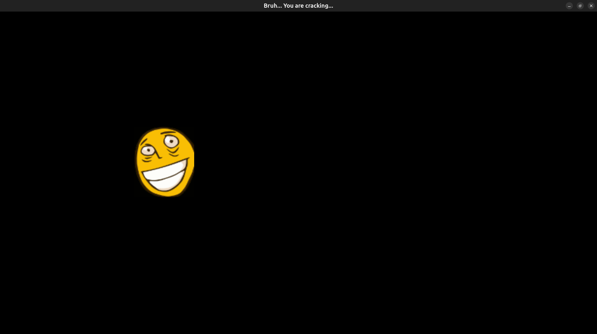

# Проект "Crack Me"

## Основные задачи

Нужно было написать программу, принимающую пароль и проверяющую его на истинность. Так же, в задаче нужно было целенаправленно допустить две уязвимости (простую и среднюю по сложности). Программа исполнялась в виртуальной машине операционной системы DOS - DOSBox, так как в данной ОС отсутствуют какие-либо ограничения на использование памяти, что сильно упрощает взлом и увеличивает его вариативность.

## Моя программа

Моя программа записана в файле [CrackMe.asm](CrackMe.asm). Она спрашивает у пользователя пароль и сравнивает его с истинным значением ('\0\0\0'), а затем, в зависимости от его истинности, выводит сообщение о подтверждении входа или об ошибке. Пароль, введённый пользователем, размещался в верхушке стека, где было выделено заранее некоторое количество байт специально для него.

### Лёгкая уязвимость

Лёгкой уязвимостью в моей программе был предусмотрен пустой пароль (простое нажатие клавиши Enter при запуске программы). Она появлялась, так как память, выделенная под пароль была заполнена нулями, а сам пароль в свою очередь и являлся набором нулей, то есть при вводе пустого пароля в буфер ничего не записывалось, а так как нет проверки на количество введённых символов, то перебор шёл по пустому буферу, значение которого совпадало с паролем, что и давало пользователю верный результат ввода.

```
    mov ah, 0Ah                     ; Функция ввода данных из прерывания DOS'а (21h)

    mov cx, STACK_ARRAY_LEN

llFreeStackArray:
    push 0h
    loop llFreeStackArray           ; Выделение 2 * CX = 2 * STACK_ARRAY_LEN байт под пароль

    push INPUT_MAX_LEN              ; Указание, что можно ввести до INPUT_MAX_LEN байт
    mov dx, sp                      ; DX указывает на байт буфера, определяющий максимальный размер ввода

    int 21h

```

### Средняя по сложности уязвимость

Данная уязвимость заключалась в том, что размер выделяемого под пароль буфера был меньше максимального количества считываемых байт, из-за чего пользователь мог перезаписать код возврата из функции, который был расположен сразу после буфера. Таким образом, можно было записать в стек адрес команды, вызывающей функцию вывода подтверждения пароля, пропуская проверку пароля. Таким образом нужно было ввести столько байт, сколько было выделено в стеке, а в конце указать адрес возврата.

## Cracking the program

I got a [program](VZLOM.COM) from [Urodish](https://github.com/kzueirf12345) for cracking. I used Turbo Debuger to disassembly it and see the commands that he used in the programs.

### Easier weakness

The easier weakness was a password started with symbol '\0'. It was done with an 'if' at the start of the program.


### Harder weakness

The harder weakness was a resident program with 21h interrupt which change the ip register and change the returning value to origin program. I change ip in stack to jump to printing function with good result. I did it in program [crack.asm](crack.asm). Another weakness with resident program was changing the address of a string, that he print, from string with bad result to the string with good result. I did it in program [crack_2.asm](crack_2.asm).

### Binary patch

The [program](src/main.cpp) in folder [src](src) open the program '.COM' and change the byte meaning JE command to JMP command in the comparison of the passwords. So in every start of the program it started unlocking with every password. The changed program is located in [cracked.com](cracked.com). Also my program make a new thread, in which it draws a Roflan, which moves like DVD player logotype. More than that it started a music from the file [VI_KA.mp3](data/VI_KA.mp3).


