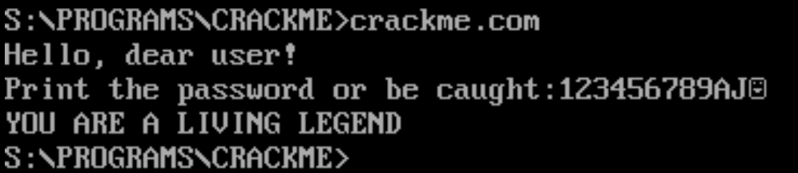
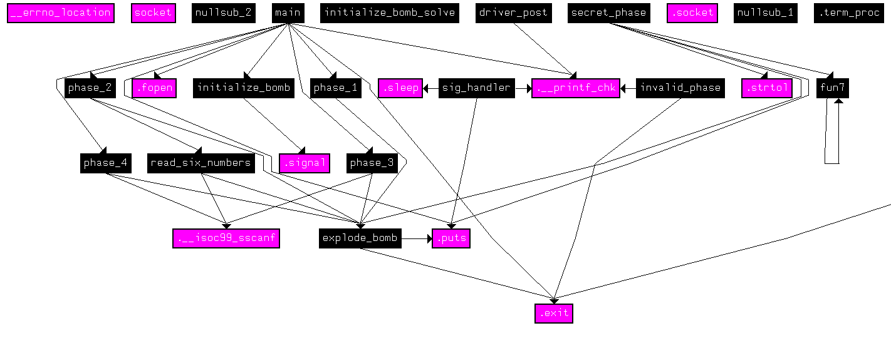
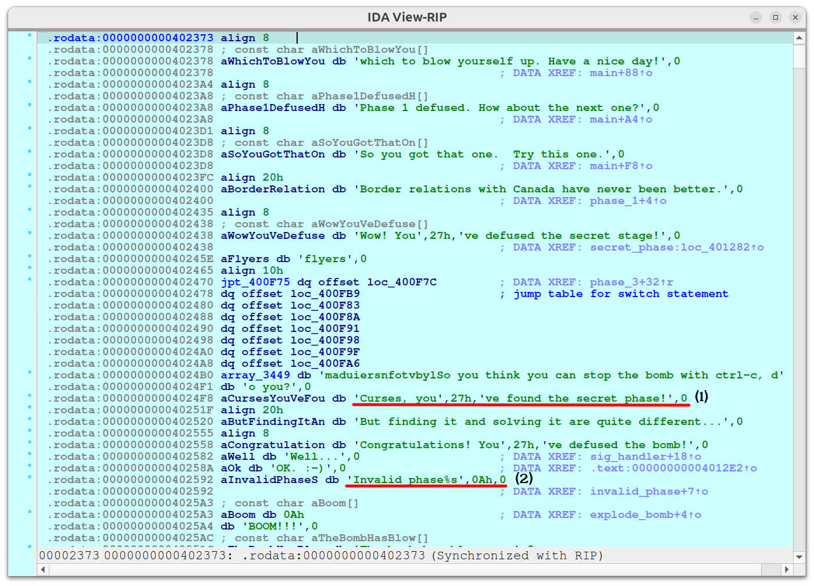
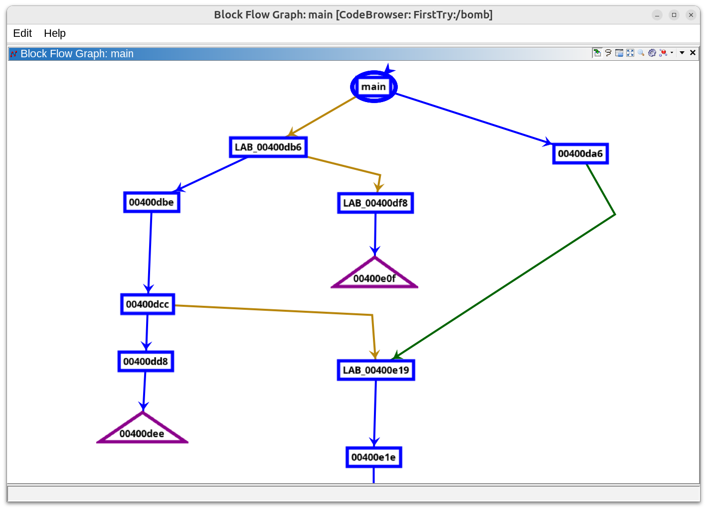
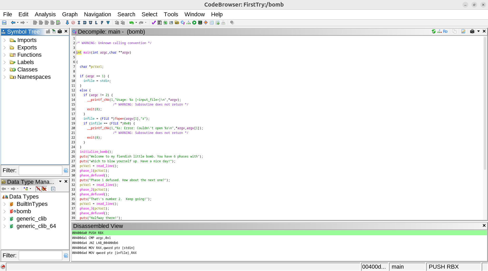
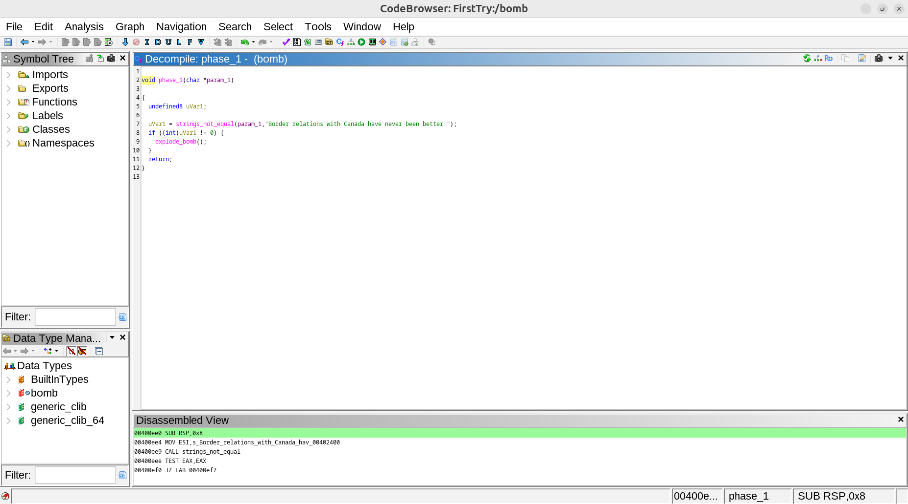
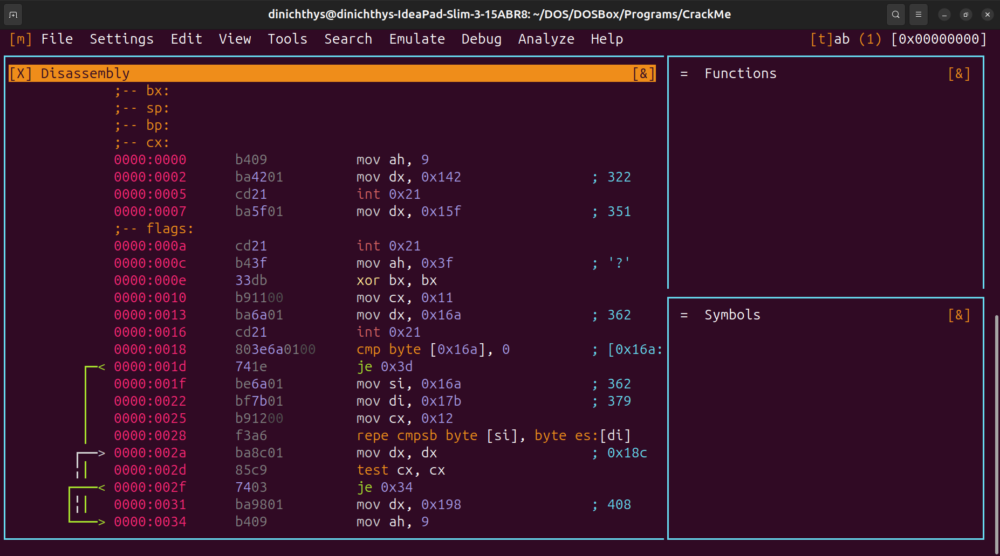
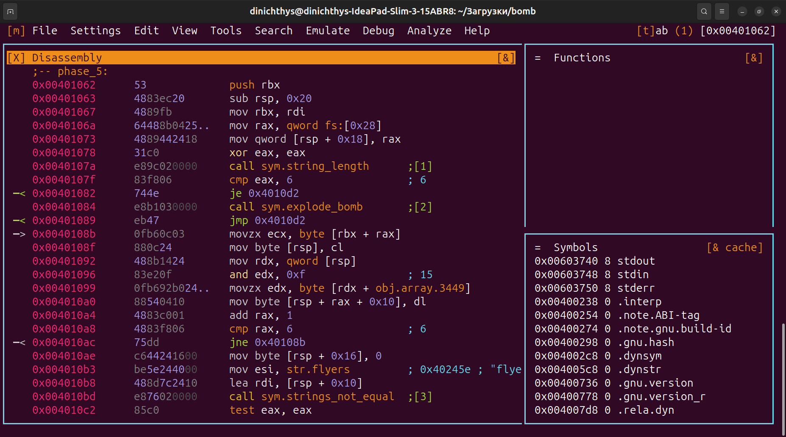
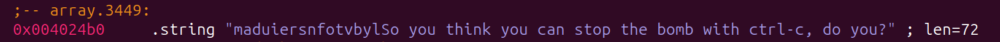
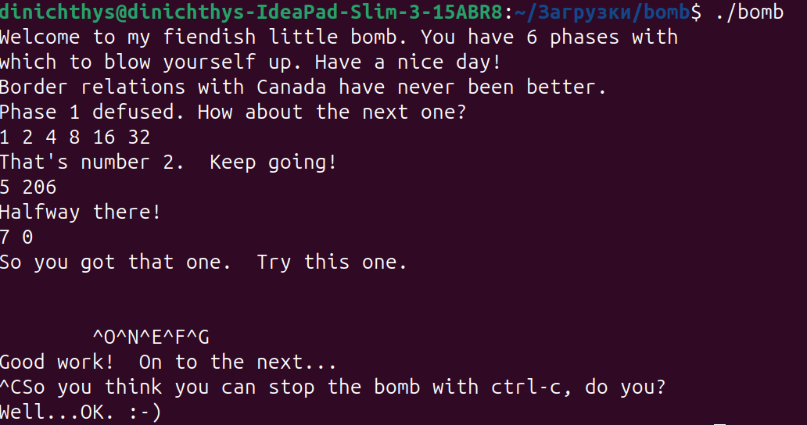

# Проект "Crack Me"

## Основные задачи

Нужно было написать программу, принимающую пароль и проверяющую его на истинность. Так же, в задаче нужно было целенаправленно допустить две уязвимости (простую и среднюю по сложности). Программа исполнялась в виртуальной машине операционной системы DOS - DOSBox, так как в данной ОС отсутствуют какие-либо ограничения на использование памяти, что сильно упрощает взлом и увеличивает его вариативность.

## Моя программа

Моя программа записана в файле [CrackMe.asm](CrackMe.asm). Она спрашивает у пользователя пароль и сравнивает его с истинным значением ('\0\0\0'), а затем, в зависимости от его истинности, выводит сообщение о подтверждении входа или об ошибке. Пароль, введённый пользователем, размещался в верхушке стека, где было выделено заранее некоторое количество байт специально для него.

#### Случай ввода верного пароля


#### Случай ввода неверного пароля


### Лёгкая уязвимость

Лёгкой уязвимостью в моей программе считался пустой пароль (простое нажатие клавиши Enter при запуске программы). Она появлялась, так как память, выделенная под пароль была заполнена нулями, а сам пароль в свою очередь и являлся набором нулей, то есть при вводе пустого пароля в буфер ничего не записывалось, а так как нет проверки на количество введённых символов, то перебор шёл по пустому буферу, значение которого совпадало с паролем, что и давало пользователю верный результат ввода.

```
    mov ah, 0Ah                     ; Функция ввода данных из прерывания DOS'а (21h)

    mov cx, STACK_ARRAY_LEN

llFreeStackArray:
    push 0h
    loop llFreeStackArray           ; Выделение 2 * CX = 2 * STACK_ARRAY_LEN байт под пароль

    push INPUT_MAX_LEN              ; Указание, что можно ввести до INPUT_MAX_LEN байт
    mov dx, sp                      ; DX указывает на байт буфера, определяющий максимальный размер ввода

    int 21h

```

#### Ввод от лица пользователя:


### Средняя по сложности уязвимость

Данная уязвимость заключалась в том, что размер выделяемого под пароль буфера был меньше максимального количества считываемых байт, из-за чего пользователь мог перезаписать код возврата из функции, который был расположен сразу после буфера. Таким образом, можно было записать в стек адрес команды, вызывающей функцию вывода подтверждения пароля, пропуская проверку пароля. Таким образом нужно было ввести столько байт, сколько было выделено в стеке, а в конце указать адрес возврата.
Адрес возврата, подходящий для взлома был равен 014A. Следовательно, в конце пароля нужно ввести `(char)01h = Ctrl+A` и `(char)4Ah = J`, однако в обратном порядке, так как в DOS реализована память в формате Little Endian, то есть младшие байты идут раньше старших в памяти.



## Взлом чужой программы

Я обменялся программами с пользователем [Urodish](https://github.com/kzueirf12345). Его файл расположен [тут](VZLOM.COM). Для дизассемблирования я использовал встроенную программу Turbo Debugger, а так же такие программы, как Radare2 и IDA.

### Лёгкая уязвимость

Лёгкой уязвимостью являлась оставленная проверка на то, что, если пароль начинается с символа '\0', то он должен считаться валидным. Таким образом, достаточно было ввести любой пароль с нулевым символом в начале, который вводится в терминале DOSBox комбиначией `Ctrl + @`.

#### Скриншот из Turbo Debugger'а, на котором видна эта проверка:


### Средняя по сложности уязвимость

Средней по сложности уязвимостью считалось "подвешивание" программы на 21h прерывание, которое обрабатывает вызовы функций DOS'а. Нужно было написать программу, подменяющую обработчик прерываний DOS'а и меняющий ip регистр, лежащий в стеке, то есть адрес возврата из прерывания. Данный метод позволяет при завершении обработки прерывания оказаться на вызове функции печати подтверждения пароля, пропуская его проверку. Такая программа прописана мной в файле [crack.asm](crack.asm). В ней я подсчитываю количество раз вызова обработчика прерывания и в нужный момент (при выводе строки с сообщением о неверном пароле) я меняю адрес возврата и убираю резидентную программу из памяти, подменяя её оригинальным обработчиком прерывания.

Другая версия использования данной уязвимости заключается в подмене адреса строки, которую хочет вывести программа в случае неверного пароля. Аналогично методу, описанному выше, я подсчитываю количество вызовов и в тот же момент, что и при замене адреса возврата, я меняю адрес вывода функции (регистр DX). Данная программа прописана в файле [crack_2.asm](crack_2.asm).

### Бинарный патч

[Программа](src/main.cpp) открывает файл `.COM` и меняет байт команды **JE** на команду **JMP** в проверке пароля на истинность. Таким образом, программа в любой ситуации считает пароль истинным, так как проверка всегда выдаёт результат совпадения паролей. Адрес нужного байта я так же узнал благодаря дизассемблированию. Итоговый результат записывается в файл [cracked.com](cracked.com).

#### Запуск программы после бинарного патча:


Так же данная программа логирует все свои действия и в параллельном потоке открывает окошко, в котором рисует движение картинки из файла [roflan.com](data/roflan.png) по траектории движения логотипа DVD, а так же запускает музыку из файла [VI_KA.mp3](data/VI_KA.mp3). Для работы с графикой используется библиотека SFML.

#### Вид окна, нарисованного программой:


## Отдельное сравнение дизассемблеров

Сравнение производилось на примере взлома программы от университета Вирджинии - The Bomb Lab. Данная программа запрашивает пароль, а затем сравнивает его тем или иным способом. Всего в задаче заявлено 6 фаз (уровней сложности), то есть 6 разных паролей, которые нужно подобрать, или обойти их проверку другим способом.

В процессе взлома использовались такие программы, как IDA Free, Radare2 и Ghidra. На разных этапах каждая из этих программ была полезна.

### IDA

Плюсы IDA в том, что, во-первых, в ней удобнее всего перемещаться по дизассемблированному коду, во-вторых, она рисует дерево вызова функций, которое впоследствии помогло мне узнать одну интересную вещь - то, что помимо заявленных 6 фаз (уровней сложности) в бомбе была ещё одна секретная фаза, которую ниоткуда в программе явно не вызывают:



На данном графе видно отдельное дерево с вызовом "секретной" фазы, что увеличивает интерес данной задачи. Так же, наличие скрытой фазы можно было обнаружить благодаря разделу со строками в ассемблерном коде:



Среди строк можно найти поздравление с обнаружением секретной фазы, что позволяет убедиться в её наличии. Однако, среди строк можно также найти строку про недействительную фазу `Invalid phase`, что даёт основу для предположения о возможности перемещения между фазами без соблюдения порядка, прописанного в **main** функции.

### Ghidra

Ghidra также была полена. Она также строила дерево вызовов функций и jmp'ов , что помогало сравнить деревья двух данных дизассемблеров.



Дерево отличается от того, что было построено в IDA, однако, оно показывает не только вызовы функций, но ещё и jump'ы.

Это не единственный плюс данного дизассемблера. Следующее его преимущество - декомпиляция программы до языка высокого уровня.

P.S.: IDA тоже умеет декомпилировать, однако, данное преимущество мне понравилось больше в Ghidra.

#### Main



#### Phase 1



Так выглядят декомпилированные функции в Ghidra. Язык высокого уровня бывает проще понять, чем команды на ассемблере, так что данная функция Ghidra является её плюсом.

### Radare2

Radare2 я использовал в моменты, когда IDA выдавала ошибки дизассемблирования, а Ghidra выводила непонятную версию декомпиляции. Radare2 же полностью справлялся со своей задачей, оставляя комментарии и рисуя стрелочками дальнейшие передвижения в **jump**'ах и **call**'ах. Однако, главное его преимущество - это то, что он работает из терминала, в отличие от других дизассемблеров.

#### Вывод в дизассемблере кода с комментариями



#### Отображение зависимостей в **jump**'ах и **call**'ах


Так, например, он помог мне разгадать 5-ую фазу бомбы:

#### 5 фаза бомбы



В данной фазе производилось хеширование пароля и проверка хеша, а так же проверка длины пароля. Обращение шло с массивом символов:



### Сравнение

Все три дизассемблера хороши по-своему, у каждого есть свои стороны, в которых они лучше других. Так, благодаря комбинации этих трёх программ я узнал о бомбе довольно много.

Так, например, я сначала нашёл в ассемблере, а затем уже проверил в терминале, что программа бомбы сама отлавливает выход из программы (комбинация `Ctrl+C`), а затем выводит сообщение и ждёт некоторое время перед выходом.

#### Дизассемблированный код в IDA


#### Вывод в терминале при завершении процесса


Более того, я смог разгадать 5 фаз бомбы. Теперь моя цель - две оставшиеся (6 и секретная 7 фазы).

#### Прохождение 5 фаз


